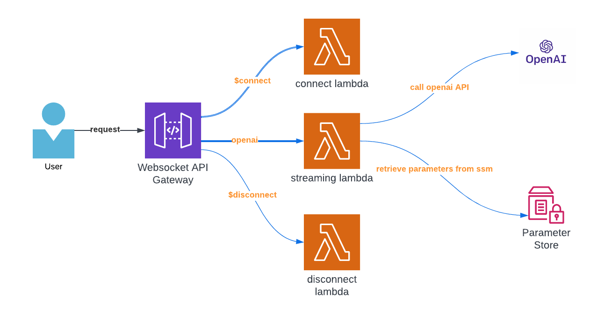

# Real-Time AI-Powered WebSocket APIs
This repository provides a demonstration of building real-time AI-powered WebSocket APIs using AWS API Gateway, Lambda, and OpenAI. The setup enables bidirectional communication between clients and the backend, with AI processing performed by OpenAI.

## Architecture Overview

The architecture consists of the following components:

- AWS WebSocket API Gateway: Serves as the entry point for WebSocket communication, facilitating real-time, bidirectional communication between clients and the backend.
- AWS Lambda Functions:
    - Connect Lambda: Handles the initial connection request and establishes the WebSocket connection.
    - Streaming OpenAI Lambda: Processes client requests, calls the OpenAI API, and sends AI-powered responses back to clients.
- OpenAI API: Provides AI capabilities and generates responses based on client queries.

## Getting Started
To get started with the project, follow the steps outlined below:

### Prerequisites
An AWS account
Basic knowledge of AWS services, including API Gateway, Lambda, and CloudFormation
An OpenAI API key (sign up on the OpenAI website if you don't have one)
### Installation and Setup
1. Clone this repository to your local machine.
2. Configure the AWS CLI with your AWS account credentials.
3. Modify the SAM template (template.yaml) with your desired configurations, such as function names, IAM roles, and OpenAI API key storage in AWS SSM Parameter Store.
4. Deploy the SAM template using AWS CloudFormation. This will provision the necessary AWS resources, including the API Gateway and Lambda functions.
5. Configure the client-side script (client.py) by providing the WebSocket API Gateway URL.
6. Run the client-side script locally to test the WebSocket connection and observe the AI-powered responses.
### Additional Customizations
Feel free to explore and customize the project further based on your requirements:

- Modify the Lambda function code to enhance or modify the AI processing logic.
- Implement additional functionalities, such as error handling or security measures.
- Integrate with other AI services or APIs to extend the capabilities of the WebSocket API.
## Contributing
Contributions to this project are welcome! If you have any ideas, improvements, or bug fixes, please open an issue or submit a pull request.

## Resources
- AWS Serverless Application Model (SAM) Documentation
- AWS CloudFormation Documentation
- AWS Lambda Documentation
- OpenAI API Documentation
- WebSocket API Gateway Documentation

Please refer to the above resources for detailed documentation on AWS services and the OpenAI API.

## Acknowledgments
This project was inspired by the need for real-time AI-powered communication and the capabilities offered by AWS services and OpenAI.
We would like to express our gratitude to the developers and contributors of the AWS SDKs, OpenAI Python library, and related open-source projects that facilitated the implementation of this project.

